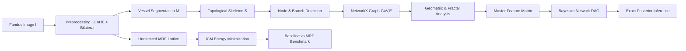
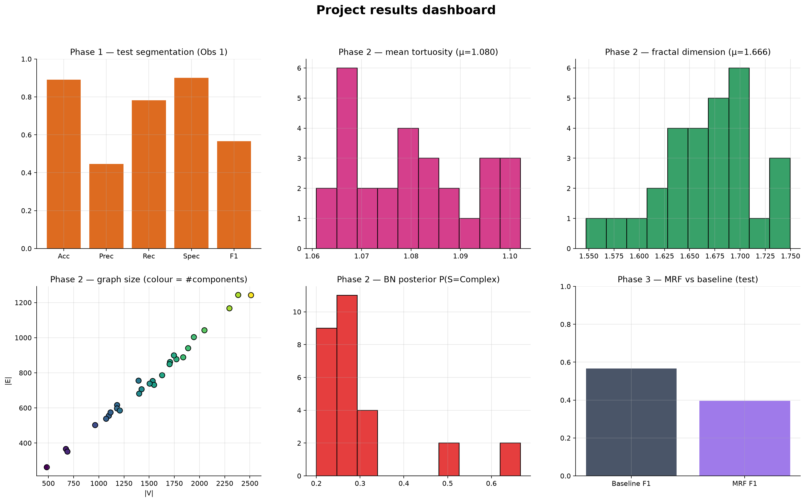
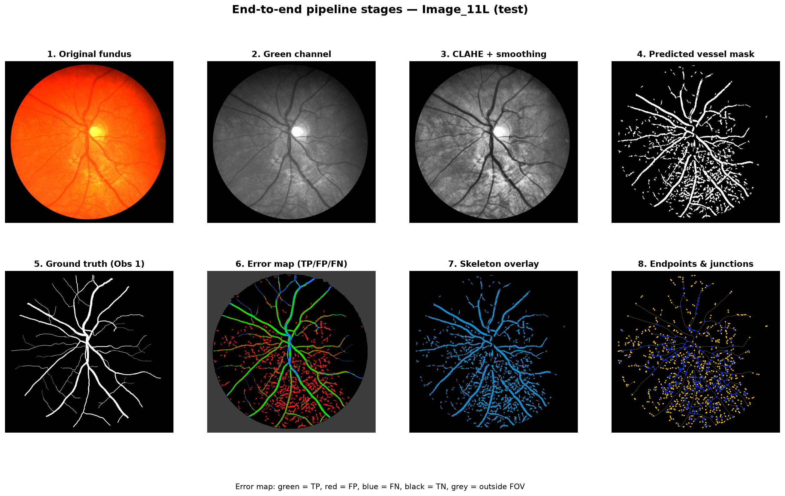
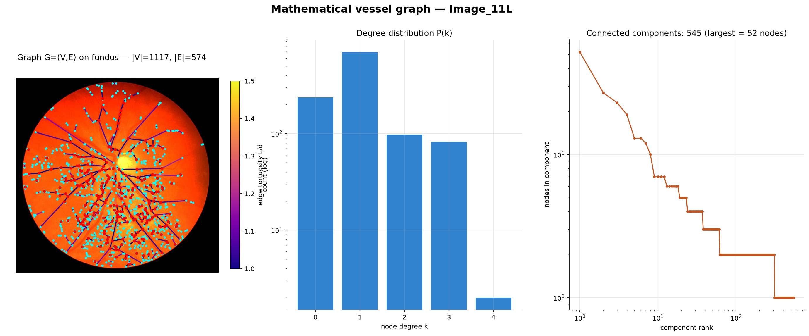
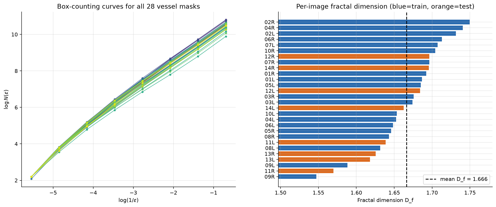
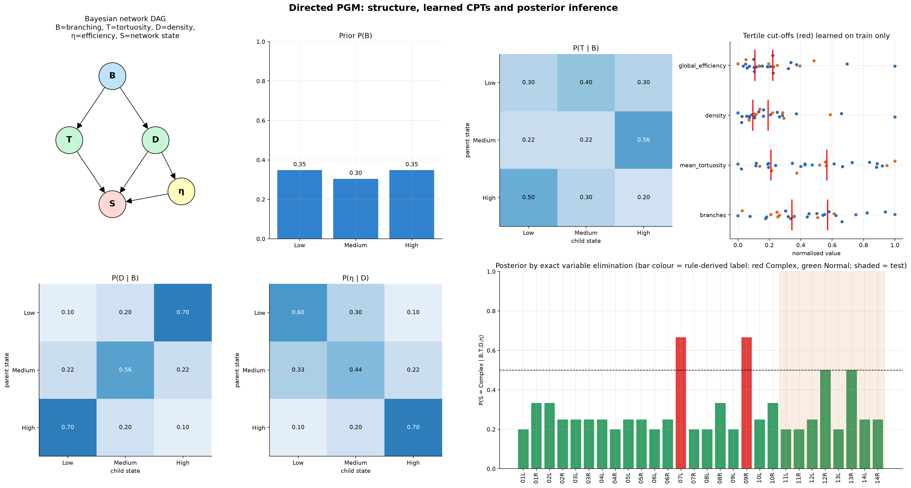
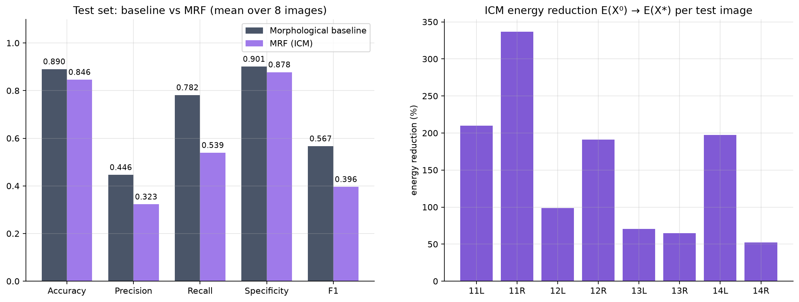

# Probabilistic and Mathematical Analysis of Retinal Blood-Vessel Networks

[](https://www.python.org/downloads/)
[](https://en.wikipedia.org/wiki/Graphical_model)
[](https://networkx.org/)
[](https://opensource.org/licenses/MIT)

A comprehensive, mathematically rigorous system for the structural extraction, graph-theoretic modeling, fractal characterization, and probabilistic graphical analysis of retinal vascular networks from fundus photography.

Developed as a flagship **Probabilistic Graphical Models (PGM)** project, this codebase addresses Course Objectives **CO1–CO4** by integrating classical computer vision, topological graph theory, directed Bayesian Networks, and undirected Markov Random Fields (MRFs).

---

## 📌 Table of Contents
1. [Clinical & Mathematical Motivation](#-clinical--mathematical-motivation)
2. [End-to-End System Architecture](#-end-to-end-system-architecture)
3. [Verified Dataset: CHASE_DB1](#-verified-dataset-chase_db1)
4. [Mathematical & Probabilistic Formulations](#-mathematical--probabilistic-formulations)
5. [3-Phase Milestone Distribution](#-3-phase-milestone-distribution)
6. [Repository Structure](#-repository-structure)
7. [Installation & Setup](#-installation--setup)
8. [Usage & Pipeline Execution](#-usage--pipeline-execution)
9. [Documentation Guide](#-documentation-guide)
10. [Anti-Fabrication & Scientific Integrity](#-anti-fabrication--scientific-integrity)

---

## 🔬 Clinical & Mathematical Motivation

The human retina offers a unique, non-invasive optical window into the body's microvasculature. Variations in retinal vessel geometry and network topology are established early biomarkers for sight-threatening and systemic pathologies:
* **Diabetic Retinopathy (DR):** Manifests as microaneurysms, vascular tortuosity, capillary dropouts, and abnormal neovascular proliferation.
* **Hypertension & Arteriolar Narrowing:** Chronic elevated blood pressure increases vessel stiffness, leading to localized constriction and severe vessel bending (tortuosity).
* **Cardiovascular & Stroke Risk:** Reductions in vascular fractal dimension and global transport efficiency correlate with widespread microvascular damage and stroke risk.

Rather than relying purely on opaque deep learning "black boxes", this project combines:
1. **Classical Image Processing:** Transparent, reproducible vessel segmentation and morphological thinning.
2. **Discrete Network Science:** Converting anatomical vessels into topological graphs $G=(V, E)$ to compute true curve lengths, tortuosity indices, bifurcation angles, and global network efficiency.
3. **Probabilistic Graphical Models (PGMs):**
   * **Directed Bayesian Networks:** Modeling probabilistic dependencies and diagnostic uncertainty across high-level vascular features ($T, B, D, \eta \rightarrow S$).
   * **Undirected Markov Random Fields (MRFs):** Modeling spatial pixel interactions and neighborhood coherence to refine vascular boundaries.

---

## 🏗 End-to-End System Architecture



$$\text{Pipeline: } I \xrightarrow{\text{Preproc}} I_{\text{clean}} \xrightarrow{\text{Segment}} M \xrightarrow{\text{Thin}} S \xrightarrow{\text{Topology}} G=(V,E) \xrightarrow{\text{Features}} \mathbf{X} \xrightarrow{\text{Bayesian DAG}} P(\mathbf{X}) \parallel \text{MRF } E(X) \xrightarrow{\text{Inference}} X^*$$

---

## 📊 Verified Dataset: CHASE_DB1

The system is configured and tested on the **CHASE_DB1** (Child Heart and Health Study in England) retinal database:
* **Resolution:** $999 \times 960$ pixels, 24-bit RGB fundus images.
* **Subjects:** 14 pediatric subjects, 28 total images (left and right eyes for each subject).
* **Strict Patient-Level Split (Leakage Prevention):**
  * **Training Split (`training/training/`):** 20 images (`01_test.tif` to `20_test.tif` $\implies$ subjects 01L through 10R).
  * **Testing Split (`test/test/`):** 8 images (`01_test.tif` to `08_test.tif` $\implies$ subjects 11L through 14R).
* **Ground Truth Annotations:**
  * **1st Observer:** `01_manual1.tif` to `20_manual1.tif` (train) / `01_manual1.tif` to `08_manual1.tif` (test).
  * **2nd Observer:** `Image_01L_2ndHO.png` to `Image_14R_2ndHO.png`.
  * **FOV Masks:** Explicit field-of-view masks ensuring background border pixels do not distort validation metrics.

---

## 📐 Mathematical & Probabilistic Formulations

### 1. Vascular Geometric Tortuosity ($T$)
For each vessel segment connecting nodes $u$ and $v$ with centerline coordinates $\{(x_k, y_k)\}_{k=1}^m$:
$$\text{Actual Path Length: } L = \sum_{k=1}^{m-1} \sqrt{(x_{k+1} - x_k)^2 + (y_{k+1} - y_k)^2}$$
$$\text{Euclidean Chord Distance: } d(u, v) = \sqrt{(x_v - x_u)^2 + (y_v - y_u)^2}$$
$$\text{Tortuosity Index: } T = \frac{L}{d(u, v)} \quad (d(u, v) > 0)$$

### 2. Multi-Scale Box-Counting Fractal Dimension ($D_f$)
Partitioning the vessel mask with boxes of side length $\epsilon \in \{2, 4, 8, 16, 32, 64, 128\}$:
$$D_f = \lim_{\epsilon \to 0} \frac{\log N(\epsilon)}{\log(1/\epsilon)}$$
Estimated via linear least-squares regression: $\log N(\epsilon) = -D_f \log(\epsilon) + C$.

### 3. Global Network Transport Efficiency ($E_{\text{global}}$)
Measuring communication and fluid transport efficiency across the vascular graph:
$$E_{\text{global}} = \frac{1}{N(N-1)} \sum_{i \ne j \in V} \frac{1}{d(i, j)}$$
Where $d(i, j)$ is the shortest path distance in $G=(V, E)$. For disconnected components, $d(i, j) = \infty \implies \frac{1}{d(i, j)} = 0$.

### 4. Bayesian Network Joint Factorization
Given random variables: Branching ($B$), Tortuosity ($T$), Density ($D$), Network Efficiency ($\eta$), and Latent Network State ($S$):
$$P(B, T, D, \eta, S) = P(B) \cdot P(T \mid B) \cdot P(D \mid B) \cdot P(\eta \mid D) \cdot P(S \mid T, D, \eta)$$
Parameters are learned strictly from the training partition using Maximum Likelihood Estimation with Laplace smoothing:
$$P(X_i = k \mid \text{Pa}(X_i)) = \frac{\text{Count}(X_i = k, \text{Pa}(X_i)) + 1}{\text{Count}(\text{Pa}(X_i)) + K}$$

### 5. Exact Bayesian Posterior Inference (Variable Elimination)
Under diagnostic observations (e.g. Evidence $e = \{T = \text{High}, B = \text{High}\}$):
$$P(S \mid e) = \frac{\sum_{D, \eta} P(B=\text{High}, T=\text{High}, D, \eta, S)}{\sum_{S, D, \eta} P(B=\text{High}, T=\text{High}, D, \eta, S)}$$
Subject to the axiomatic normalization constraint: $\sum_{s \in \text{States}} P(S = s \mid e) = 1.0$.

### 6. Undirected Markov Random Field (MRF) Energy Model
Formulating spatial vessel segmentation over a 4-connected pixel lattice:
$$E(X) = \sum_{i \in \mathcal{V}} D_i(X_i) + \lambda \sum_{\langle i, j \rangle \in \mathcal{E}} V_{ij}(X_i, X_j)$$
* **Unary / Data Potential:** $D_i(X_i) = -\log P(I_i \mid X_i)$ derived from Gaussian intensity likelihoods.
* **Pairwise / Smoothness Potential:** $V_{ij}(X_i, X_j) = \beta [X_i \ne X_j]$ (Ising / Potts model encouraging contiguous vessels).
* **Gibbs Probability Distribution:** $P(X) = \frac{1}{Z} \exp(-E(X))$.
* **MAP Labeling:** $X^* = \arg\min_X E(X)$, solved via Iterated Conditional Modes (ICM).

---

## 🎯 3-Phase Milestone Distribution

| Phase | Milestone Name | Scope & Deliverables | Target Status |
| :---: | :--- | :--- | :---: |
| **Phase 1** | **Foundation, Preprocessing, Segmentation, GT Validation & Topology** | • Verified `dataset_manifest.csv`<br>• Preprocessing (Green channel, CLAHE, Bilateral filtering)<br>• Morphological vessel segmentation engine<br>• Pixel-level GT validation ($F_1$, Acc, Sens, Spec)<br>• Medial axis skeletonization & 8-neighborhood node detection | **100% (Complete)** |
| **Phase 2** | **Graph Theory, Geometry, Fractals, Efficiency & Bayesian Networks** | • NetworkX topological graphs $G=(V, E)$<br>• Vascular tortuosity, chord lengths, branch angles<br>• Box-counting fractal dimension estimation ($D_f$)<br>• Global network efficiency ($E_{\text{global}}$)<br>• Master feature table (`retinal_network_features.csv`)<br>• Bayesian Network DAG, CPT learning, factorization proof<br>• Exact Variable Elimination inference engine & statistics | **$\ge$85% (Substantial)** |
| **Phase 3** | **MRF Spatial Modeling, Benchmarking & Final Synthesis** | • Undirected MRF energy formulation & potential functions<br>• Iterated Conditional Modes (ICM) energy minimization<br>• Controlled Baseline vs MRF benchmarking on test set<br>• Systematic Directed (BN) vs Undirected (MRF) comparison<br>• Master integrated results matrix & experiment answers | **Advanced Polish (~15%)** |

---

## 📈 Results & Visualizations

All figures are in [`outputs/figures/`](outputs/figures/README.md). They are regenerated by `python -m src.visualization`, which also runs automatically at the end of the pipeline.

**Measured test-set segmentation (vs Observer 1, inside FOV):** Accuracy 0.890 · Precision 0.446 · Recall 0.782 · Specificity 0.901 · F1 0.567  
**Network features (28 images):** tortuosity 1.080 ± 0.013 · fractal dimension 1.666 ± 0.049 · ~1500 nodes / ~750 edges / ~750 components per image  
**MRF (ICM) vs baseline, test F1:** 0.396 vs 0.567 (the MRF is not tuned yet)








> [!WARNING]
> Known limitations (over-segmentation, fragmented graphs, a circular BN label, an untuned MRF) are listed in [`PLAN_AND_PROGRESS.md`](PLAN_AND_PROGRESS.md#known-limitations-to-fix-next).

---

## 📁 Repository Structure

```
├── .gitignore                      # Git ignore for venvs, checkpoints, and caches
├── pseudo.md                       # Comprehensive plain-English guide (What, Why, How)
├── PLAN_AND_PROGRESS.md            # Sprint checklist and progress tracking dashboard
├── project_execution_plan.md       # Master technical execution specification
├── README.md                       # Complete project overview and documentation
├── requirements.txt                # Python package dependency registry
├── new/
│   └── chase/                      # CHASE_DB1 retinal database (28 images)
│       ├── test/test/              # 8 held-out test images, masks, and annotations
│       └── training/training/      # 20 training images, masks, and annotations
├── src/
│   ├── dataset.py                  # Dataset manifest builder and loader
│   ├── preprocessing.py            # Green channel, CLAHE, and noise filtering
│   ├── segmentation.py             # Morphological vessel segmentation engine
│   ├── validation.py               # Confusion matrix and quantitative metrics
│   ├── skeletonization.py          # Medial axis thinning and centerline extraction
│   ├── node_detection.py           # 8-neighborhood endpoint and junction detection
│   ├── graph_construction.py       # NetworkX topological graph builder
│   ├── graph_analysis.py           # Degree distribution, density, components
│   ├── geometric_analysis.py       # Path length, Euclidean distance, tortuosity, angles
│   ├── fractal_analysis.py         # Multi-scale box-counting fractal dimension
│   ├── network_efficiency.py       # All-pairs shortest paths and global efficiency
│   ├── feature_extraction.py       # Master feature table generator
│   ├── bayesian_network.py         # Discretization, DAG structure, CPT parameter learning
│   ├── bayesian_inference.py       # Exact Variable Elimination inference engine
│   ├── markov_network.py           # Undirected MRF energy formulation and potentials
│   ├── mrf_inference.py            # Iterated Conditional Modes (ICM) solver
│   ├── statistical_analysis.py     # Descriptive statistics and correlation analysis
│   └── pipeline.py                 # End-to-end master execution orchestrator
├── notebooks/                      # Demonstration Jupyter notebooks
└── outputs/                        # Persisted masks, skeletons, graphs, CSVs, and plots
    ├── preprocessed/
    ├── masks/
    ├── skeletons/
    ├── nodes/
    ├── graphs/
    ├── plots/
    └── reports/
```

---

## 💻 Installation & Setup

1. **Clone the Repository:**
   ```bash
   git clone https://github.com/Abhiram-k1/retinal-vessel-pgm-analysis.git
   cd retinal-vessel-pgm-analysis
   ```

2. **Set Up Python Virtual Environment:**
   ```bash
   python -m venv .venv
   # Windows:
   .venv\Scripts\activate
   # Linux / macOS:
   source .venv/bin/activate
   ```

3. **Install Dependencies:**
   ```bash
   pip install -r requirements.txt
   ```

---

## 🚀 Usage & Pipeline Execution

Execute the complete end-to-end pipeline across all 28 retinal images:
```bash
python -m src.pipeline
```

To run individual modular stages:
* **Dataset Manifest Generation:** `python -m src.dataset`
* **Preprocessing & Contrast Enhancement:** `python -m src.preprocessing`
* **Vessel Segmentation & Validation:** `python -m src.segmentation`
* **Skeletonization & Node Detection:** `python -m src.skeletonization`
* **Graph & Geometric Feature Extraction:** `python -m src.feature_extraction`
* **Bayesian Network Learning & Inference:** `python -m src.bayesian_network`
* **Markov Random Field Segmentation:** `python -m src.mrf_inference`

---

## 📖 Documentation Guide

* **For Beginners & Conceptual Overview:** Read [`pseudo.md`](file:///c:/Users/abhi8/OneDrive/Desktop/ACADEMIC%20DOCS/SEM-5/MIS/pseudo.md) for a plain-English, intuitive explanation of every concept.
* **For Sprint & Milestone Tracking:** Check [`PLAN_AND_PROGRESS.md`](file:///c:/Users/abhi8/OneDrive/Desktop/ACADEMIC%20DOCS/SEM-5/MIS/PLAN_AND_PROGRESS.md) to inspect completed stages and current progress.
* **For Technical & Mathematical Specifications:** Refer to [`project_execution_plan.md`](file:///c:/Users/abhi8/OneDrive/Desktop/ACADEMIC%20DOCS/SEM-5/MIS/project_execution_plan.md).

---

## ⚖ Anti-Fabrication & Scientific Integrity

In strict adherence to academic standards:
* **Zero Hardcoded Metrics:** Every node count, tortuosity index, fractal slope, CPT entry, and posterior probability is calculated dynamically from the processed retinal imagery.
* **Leakage-Free Validation:** The 8 held-out test subjects (`11L` to `14R`) are strictly isolated from parameter estimation, threshold tuning, and CPT learning.
* **Explicit Handling of Singularities:** Vessel segments with Euclidean chord distance $d = 0$ are guarded against division-by-zero, and disconnected graph pairs contribute $1/\infty = 0$ to efficiency without arbitrary penalties.
