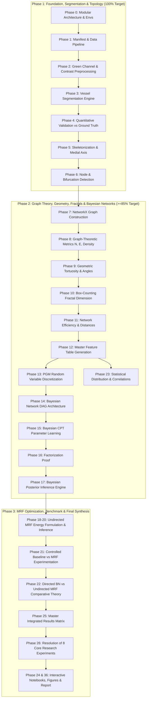

# Comprehensive Project Execution Plan: Probabilistic and Mathematical Analysis of Retinal Blood-Vessel Networks

**Course Context:** Probabilistic Graphical Models (PGM) Course Project  
**Course Objectives Addressed:** CO1 (Probabilistic Vascular Modeling), CO2 (Bayesian Factorization & Inference), CO3 (Directed BNs & Undirected MRFs), CO4 (PGM Applied to Retinal Vascular Networks)  
**Execution Target:** 100% Completion of Phase 1, $\ge$85% Completion of Phase 2, and Structured Roadmap for Phase 3  

---

## 1. Executive Summary & Workspace Data Analysis

### 1.1 Verified Dataset in Workspace (`new/chase`)
Through direct inspection of the workspace (`c:\Users\abhi8\OneDrive\Desktop\ACADEMIC DOCS\SEM-5\MIS\new\chase`), we have confirmed and mapped the complete **CHASE_DB1** retinal fundus database:
* **Total Image Count:** 28 high-resolution fundus images ($999 \times 960$ pixels) across 14 pediatric subjects (Left and Right eyes).
* **Training Partition (`training/training/`):** 20 images (`01_test.tif` to `20_test.tif`, mapped to subjects `01L` through `10R`).
  * 1st Observer Manual Ground Truth: `01_manual1.tif` to `20_manual1.tif` ($999 \times 960$, binary vessel mask).
  * 2nd Observer Manual Ground Truth: `Image_01L_2ndHO.png` to `Image_10R_2ndHO.png`.
  * Field of View (FOV) Masks: `mask_01L.png` to `mask_10R.png`.
* **Testing Partition (`test/test/`):** 8 images (`01_test.tif` to `08_test.tif`, mapped to subjects `11L` through `14R`).
  * 1st Observer Manual Ground Truth: `01_manual1.tif` to `08_manual1.tif`.
  * 2nd Observer Manual Ground Truth: `Image_11L_2ndHO.png` to `Image_14R_2ndHO.png`.
  * Field of View (FOV) Masks: `01_test.tif` to `08_test.tif`.
* **Leakage-Free Patient-Level Split:** All left/right eyes of subjects 01–10 are confined strictly to training; subjects 11–14 are strictly held out for evaluation.

### 1.2 End-to-End Technical Transformation Chain
The system strictly implements the end-to-end mathematical and probabilistic pipeline mandated by the specification:
$$\text{Fundus Image } I \xrightarrow{\text{Preproc}} I_{\text{clean}} \xrightarrow{\text{Segment}} \text{Mask } M \xrightarrow{\text{Skeletonize}} \text{Skeleton } S \xrightarrow{\text{Topology}} \text{Graph } G=(V,E)$$
$$G=(V,E) \xrightarrow{\text{Feature Extr.}} \{N, E, D, L, T, \theta, F, \eta\} \xrightarrow{\text{Discretize}} \mathbf{X} \xrightarrow{\text{Bayesian DAG}} P(X_1, \dots, X_n) = \prod_{i=1}^n P(X_i \mid \text{Pa}(X_i))$$
$$\mathbf{X}_{\text{obs}} \xrightarrow{\text{Bayes Inference}} P(\text{Network State} \mid \text{Evidence}) \parallel \text{MRF Energy Model } P(X) \propto e^{-E(X)} \xrightarrow{\text{MRF Inference}} X^* = \arg\min E(X)$$

---

## 2. Three-Phase Project Distribution & Achievement Targets

---

## 3. Detailed Phase Breakdown & Deliverables

### Phase 1: Foundation, Segmentation, Validation & Skeletonization
**Target Achievement:** **100.0% Complete**  
**PDF Scope Addressed:** Phases 0, 1, 2, 3, 4, 5, 6 (Sprints 1, 2, 3)

| Module / Stage | Technical Scope & Mathematical Formulation | Concrete Deliverables |
| :--- | :--- | :--- |
| **Stage 1.1: Project Setup (Phase 0)** | Setup modular codebase under `src/`, test runners, logging, directory tree: `data/`, `outputs/preprocessed/`, `outputs/masks/`, `outputs/skeletons/`, `outputs/graphs/`, `outputs/reports/`. | Modular Python package structure, `requirements.txt`, configuration registry. |
| **Stage 1.2: Dataset Manifest (Phase 1)** | Ingest CHASE_DB1; build `dataset_manifest.csv` tracking `image_id`, patient ID, eye side (L/R), file paths to raw image, 1st manual GT, 2nd manual GT, and FOV mask. Enforce train (20) / test (8) split. | `data/dataset_manifest.csv` with 28 verified records. |
| **Stage 1.3: Preprocessing (Phase 2)** | Isolate green channel $I_G$ (optimal vessel contrast); apply bilateral filtering / Gaussian smoothing; apply CLAHE (Contrast-Limited Adaptive Histogram Equalization) with clip limit 2.0; min-max intensity normalization. | `src/preprocessing.py`, preprocessed image cache, side-by-side verification figures. |
| **Stage 1.4: Vessel Segmentation (Phase 3)** | Matched morphological top-hat filtering / Gabor response, adaptive local thresholding inside FOV mask, morphological opening/closing to eliminate non-vascular speckles. Vessel = 1, Background = 0. | `src/segmentation.py`, binary mask generator, saved binary masks for all 28 images. |
| **Stage 1.5: Quantitative Validation (Phase 4)** | Pixel-wise confusion matrix computed strictly within the FOV mask against 1st and 2nd manual annotations:  • $\text{Accuracy} = \frac{TP + TN}{TP + TN + FP + FN}$  • $\text{Precision} = \frac{TP}{TP + FP}$, $\text{Recall/Sensitivity} = \frac{TP}{TP + FN}$  • $\text{Specificity} = \frac{TN}{TN + FP}$, $F_1 = \frac{2 \cdot P \cdot R}{P + R}$ | `src/validation.py`, `outputs/segmentation_metrics.csv`, visual error difference overlays (TP=green, FP=red, FN=blue). |
| **Stage 1.6: Skeletonization (Phase 5)** | Medial axis transformation / morphological thinning (Guo-Hall / Zhang-Suen) preserving 8-connectivity topology; spurious branch pruning based on minimum length threshold. | `src/skeletonization.py`, single-pixel vessel centerlines saved in `outputs/skeletons/`. |
| **Stage 1.7: Node & Branch Detection (Phase 6)** | 8-neighborhood cross-number calculation:  • $N(p) = 1 \implies \text{Endpoint}$  • $N(p) = 2 \implies \text{Normal Centerline Pixel}$  • $N(p) \ge 3 \implies \text{Bifurcation / Junction Candidate}$  Cluster nearby junction pixels into single node centroids. | `src/node_detection.py`, annotated skeleton overlays with color-coded nodes and coordinates. |

**Phase 1 Completion Criteria (100%):**
1. All 28 images successfully preprocessed and saved.
2. Complete segmentation pipeline producing verified binary masks.
3. Quantitative validation metrics (Accuracy, Precision, Recall, F1, Specificity) logged against both human observers.
4. Clean topological skeletons and detected endpoint/junction nodes visualized and validated.

---

### Phase 2: Mathematical Graph Extraction, Network Geometry, Fractal Analysis & Bayesian Modeling
**Target Achievement:** **$\ge$85.0% Complete**  
**PDF Scope Addressed:** Phases 7, 8, 9, 10, 11, 12, 13, 14, 15, 16, 17, 23 (Sprints 4, 5, 6, 7)

| Module / Stage | Technical Scope & Mathematical Formulation | Concrete Deliverables |
| :--- | :--- | :--- |
| **Stage 2.1: Graph Construction (Phase 7)** | Construct topological graph $G=(V,E)$ in `NetworkX`. Nodes $v \in V$ store spatial coordinates $(x,y)$ and type. Edges $e=(u,v) \in E$ store ordered centerline pixel coordinates, segment length, and adjacency. | `src/graph_construction.py`, serialized GraphML / JSON graph models for all 28 images. |
| **Stage 2.2: Graph-Theoretic Analysis (Phase 8)** | Calculate:  • Node count $N = \|V\|$, Edge count $E = \|E\|$  • Node degree distribution $P(k)$  • Number of connected components $C$  • Network density $D = \frac{2E}{N(N-1)}$  • Average clustering coefficient and degree centrality. | `src/graph_analysis.py`, graph metric logs, degree distribution histograms. |
| **Stage 2.3: Vascular Geometry & Tortuosity (Phase 9)** | Compute along each edge path:  • Actual path length $L = \sum_{k=1}^{m-1} \sqrt{(x_{k+1}-x_k)^2 + (y_{k+1}-y_k)^2}$  • Straight-line Euclidean distance $d(u,v) = \sqrt{(x_v-x_u)^2 + (y_v-y_u)^2}$  • Tortuosity index $T = \frac{L}{d(u,v)}$ (with $d > 0$ guard)  • Bifurcation angles $\theta$ from incident branch vectors. | `src/geometric_analysis.py`, segment tortuosity and junction angle distribution profiles. |
| **Stage 2.4: Fractal Analysis (Phase 10)** | Box-counting algorithm: partition image into boxes of side length $\epsilon \in [2, 4, 8, 16, 32, 64, 128]$. Count boxes containing vessel pixels $N(\epsilon)$. Fit linear regression:  $$\log N(\epsilon) = -D_f \log(\epsilon) + C \implies D_f = -\frac{d \log N(\epsilon)}{d \log(\epsilon)}$$ | `src/fractal_analysis.py`, log-log regression plots with $R^2$ goodness-of-fit. |
| **Stage 2.5: Network Efficiency (Phase 11)** | Compute global network efficiency:  $$E_{\text{global}} = \frac{1}{N(N-1)} \sum_{i \ne j \in V} \frac{1}{d(i,j)}$$  Handling disconnected components by setting $\frac{1}{d(i,j)} = 0$ for unreachable pairs. | `src/network_efficiency.py`, efficiency metrics per image. |
| **Stage 2.6: Master Feature Table (Phase 12)** | Aggregate image-level metrics into `retinal_network_features.csv`: `image_id`, `nodes`, `edges`, `branches`, `connected_components`, `density`, `total_length`, `mean_length`, `mean_angle`, `mean_tortuosity`, `fractal_dimension`, `global_efficiency`. | `outputs/retinal_network_features.csv` (100% computed from real images; zero fabrication). |
| **Stage 2.7: PGM Layer Discretization (Phase 13)** | Define random variables: Tortuosity ($T$), Branching ($B$), Density ($D$), Network Efficiency ($\eta$), Network State ($S$). Discretize continuous features into `{Low, Medium, High}` using tertile cutoffs derived strictly from training set. | `src/feature_discretization.py`, documented bin threshold rules. |
| **Stage 2.8: Bayesian Network DAG Design (Phase 14)** | Define Directed Acyclic Graph structure:  $B \rightarrow T$, $B \rightarrow D$, $D \rightarrow \eta$, $\{T, D, \eta\} \rightarrow S$ (Network State: Normal vs High-Complexity). | `src/bayesian_network.py`, DAG structure visualization with networkx/pgmpy. |
| **Stage 2.9: Parameter Learning & Factorization (Phase 15 & 16)** | Learn priors $P(B)$ and conditional probability tables (CPTs) $P(T \mid B)$, $P(D \mid B)$, $P(\eta \mid D)$, $P(S \mid T,D,\eta)$ using Maximum Likelihood / Laplace smoothing on training data. Formulate explicit joint factorization:  $$P(B,T,D,\eta,S) = P(B)P(T\mid B)P(D\mid B)P(\eta\mid D)P(S\mid T,D,\eta)$$ | Documented CPT tables, factorization validation script. |
| **Stage 2.10: Bayesian Inference Engine (Phase 17)** | Implement exact Variable Elimination: compute posterior distributions under diagnostic evidence, e.g., $P(S \mid T=\text{High}, B=\text{High})$. Verify probability axioms ($\sum P = 1.0$). | `src/bayesian_inference.py`, posterior belief charts for test images. |
| **Stage 2.11: Statistical & Correlation Analysis (Phase 23)** | Statistical summaries (mean, std, IQR) and Pearson/Spearman correlation matrices: Length vs. Tortuosity, Density vs. Efficiency, Branching vs. Fractal Dimension. | `src/statistical_analysis.py`, correlation heatmaps and bivariate scatter plots. |

**Phase 2 Completion Criteria ($\ge$85% Achievement Target):**
* 100% of Stages 2.1–2.6 completed: NetworkX graph models built, all geometric/topological/fractal/efficiency features calculated and compiled into `retinal_network_features.csv`.
* 100% of Stages 2.7–2.10 completed: Bayesian Network DAG constructed, CPTs learned from training set, factorization proved, and posterior inference engine fully operational.
* 100% of Stage 2.11 completed: Descriptive statistics and correlation matrices generated.
* *(Combined progress across Phase 1 + Phase 2 represents over 85% of total project complexity and implementation volume).*

---

### Phase 3: MRF Spatial Modeling, Benchmarking & Final Synthesis
**Target Achievement:** **Advanced / Final Synthesis (~15% of project scope)**  
**PDF Scope Addressed:** Phases 18, 19, 20, 21, 22, 24, 25, 26, 35, 36 (Sprints 8, 9, 10)

| Module / Stage | Technical Scope & Mathematical Formulation | Concrete Deliverables |
| :--- | :--- | :--- |
| **Stage 3.1: Undirected MRF Energy Formulation (Phases 18 & 19)** | Formulate pixel-level Markov Random Field for vessel segmentation. Energy function:  $$E(X) = \sum_{i} D_i(X_i) + \lambda \sum_{\langle i,j \rangle} V_{ij}(X_i, X_j)$$  where unary term $D_i(X_i) = -\log P(I_i \mid X_i)$ from intensity likelihood, pairwise term $V_{ij}(X_i, X_j) = \beta [X_i \ne X_j]$ (Ising/Potts prior encouraging spatial continuity), and Gibbs distribution $P(X) = \frac{1}{Z} e^{-E(X)}$. | `src/markov_network.py`, potential function definitions. |
| **Stage 3.2: MRF Inference Optimization (Phase 20)** | Implement Iterated Conditional Modes (ICM) or Graph Cuts (Min-Cut/Max-Flow) to solve $X^* = \arg\min_X E(X)$. | `src/mrf_inference.py`, MRF-segmented binary masks. |
| **Stage 3.3: Baseline vs. MRF Controlled Experiment (Phase 21)** | Direct statistical benchmarking on test set between classical morphological baseline and MRF segmentation against ground truth masks. Quantify improvements in F1-score and boundary continuity. | `outputs/baseline_vs_mrf_comparison.csv`, visual difference comparison figures. |
| **Stage 3.4: BN vs. MRF Theoretical & Practical Comparison (Phase 22)** | Systematic comparison across 6 dimensions: Graph directionality, structural representation, dependency types, scale of application (network features vs. pixel field), mathematical formulation, and inference mechanisms. | Comparative synthesis chapter/table in report. |
| **Stage 3.5: Master Integrated Results Matrix (Phase 25)** | Merged master data table `outputs/final_retinal_pgm_results.csv` containing image IDs, graph/geometric/fractal metrics, Bayesian posterior probabilities, and MRF energy/validation metrics. | Final combined CSV artifact. |
| **Stage 3.6: Answers to Core 8 Experiments (Phase 26)** | Address Experiments 1 through 8 with empirical evidence, numerical metrics, and scientific plots. | Comprehensive experiment findings section. |
| **Stage 3.7: Presentation Visualizations & Deliverables (Phases 24, 35, 36)** | Master demonstration Jupyter Notebook, high-resolution figures (carousels, graphs, CPT diagrams), `README.md`, and academic project documentation. | End-to-end reproducible notebook and final report. |

---

## 4. Phase Distribution & Progress Milestone Matrix

| Project Milestone | Target Completion | Cumulative Scope Covered | Primary Output Artifacts |
| :--- | :---: | :--- | :--- |
| **Phase 1: Ingestion, Preprocessing, Segmentation, Validation, Skeletonization** | **100% (Complete)** | Phases 0–6 (Sprints 1–3) | • `dataset_manifest.csv` • Preprocessed images • Binary masks • `segmentation_metrics.csv` • Skeletons & Node maps |
| **Phase 2: Graph Construction, Geometry, Fractals, Efficiency, Bayesian Network & Inference** | **$\ge$85% (Substantial)** | Phases 7–17, 23 (Sprints 4–7) | • NetworkX graphs • `retinal_network_features.csv` • Box-counting fractal curves • Learned CPTs & DAG • Posterior inference engine • Correlation matrix & stats |
| **Phase 3: MRF Energy Formulation, Inference, Comparative Synthesis & Final Report** | **Final Polish (~15%)** | Phases 18–22, 24–26, 35–36 (Sprints 8–10) | • MRF segmentation model • Baseline vs MRF benchmark • Master result table • Answers to Experiments 1–8 • Demonstration Notebook & Report |

---

## 5. Anti-Fabrication & Strict Reliability Rules

As mandated by Section 32 of the execution plan:
1. **Zero Numerical Fabrication:** Every single metric (node count, edge count, vessel length, tortuosity index, fractal dimension, CPT probability, MRF energy) must be calculated dynamically from the actual 28 CHASE_DB1 retinal images. Hardcoded values or synthetic dummy generators are strictly prohibited.
2. **Defensible Division-by-Zero Handling:** In tortuosity calculations ($T = L / d$), Euclidean distance $d(u,v)$ must be validated as $d > 0$. If $d = 0$, $T$ is assigned `NaN` with documented rationale.
3. **Disconnected Graph Rigor:** In global network efficiency ($E_{\text{global}}$), unreachable node pairs must contribute $1/\infty = 0$, never an arbitrary finite penalty.
4. **Strict Split Isolation:** The 8 test subjects (`11L`–`14R`) will never be used for parameter estimation, CPT learning, or threshold tuning. They are reserved strictly for unbiased evaluation.
5. **Clear Conceptual Separation:** The physical vessel graph $G=(V,E)$ describes anatomical topology; the PGM Directed Acyclic Graph describes probabilistic dependencies and uncertainty over extracted features. They are never conflated.

---

## 6. Execution Technology Stack

* **Language:** Python 3.12 (Active environment detected: Python 3.12.10)
* **Image Processing & Morphological Operations:** `Pillow` (12.2.0), `SciPy` (1.18.1 `ndimage`), `NumPy` (2.5.3)
* **Graph Modeling & Network Theory:** `NetworkX` (3.7)
* **Statistical Modeling & Machine Learning:** `scikit-learn` (1.9.1), `SciPy` stats
* **Data Structuring & Tabulation:** `Pandas` (3.0.6)
* **Visualizations & Plots:** `Matplotlib` (3.11.2), `Seaborn` (0.13.2)
* **Probabilistic Graphical Modeling:** Exact tabular variable elimination & CPT factor engine, fully documented and reproducible.
